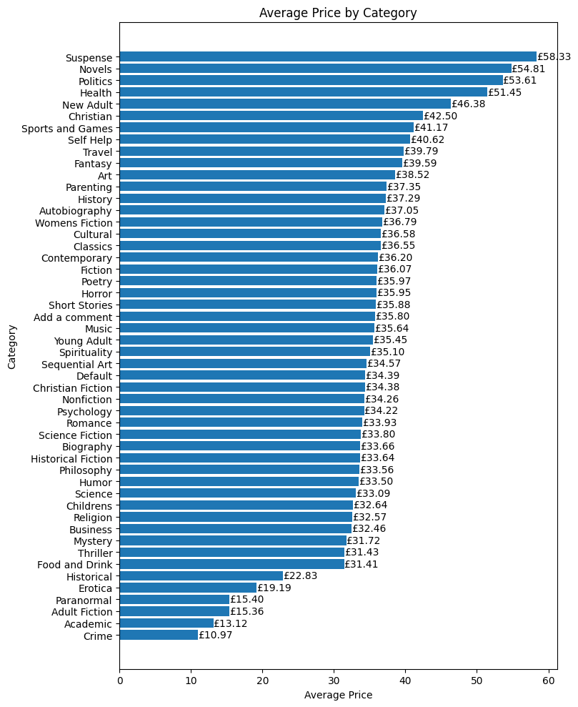
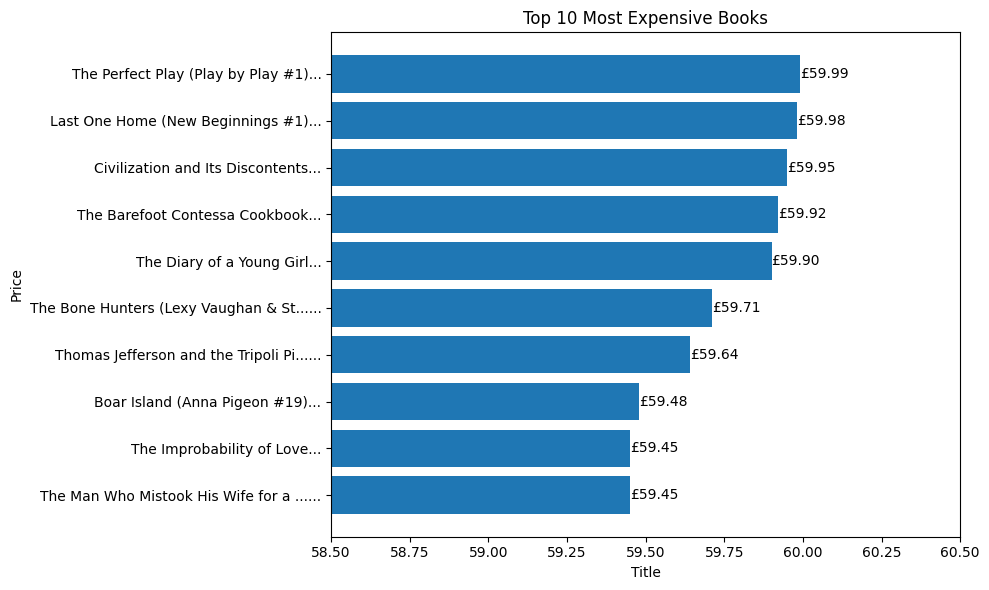
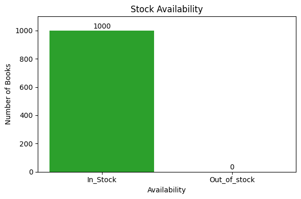
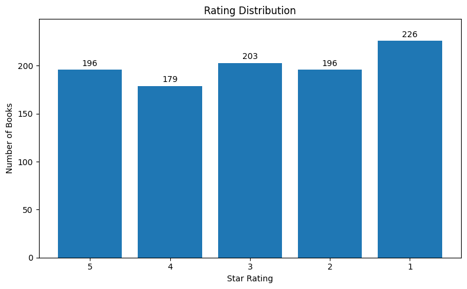

# 📚 Book Price Intelligence Scraper

An end-to-end web scraping and business intelligence pipeline that automatically collects book data across all categories from an e-commerce site, stores it in a relational database, and generates price analysis reports with visualizations.

---

## ⚠️ The Business Problem

Retailers and buyers tracking competitor pricing across hundreds of product categories have no efficient way to collect, compare, and analyze pricing data manually. This pipeline automates the entire process — from data collection to structured reporting — in a single run.

## 💡 The Solution

A four-stage automated pipeline that scrapes 1,000 books across 50 categories, handles multi-page pagination automatically, cleans and normalizes the raw data, loads it into SQLite, and generates category-level pricing reports with charts.

---

## Pipeline Overview

```
books.toscrape.com  →  scraper.py  →  raw CSV  →  cleaner.py  →  
clean CSV  →  db_loader.py  →  SQLite DB  →  report_gen.py  →  Reports + Charts
```

**Run the full pipeline in 4 commands:**

```bash
python scraper.py
python cleaner.py
python db_loader.py
python report_gen.py
```

---

## What Each Script Does

### `scraper.py`
- Fetches all 50 category links from the site's navigation
- For each category, recursively follows pagination until the last page
- Extracts title, raw price, star rating class, availability, and category for every book
- Saves raw uncleaned data to `data/raw/books_raw.csv`
- Includes `time.sleep(0.5)` between requests to avoid rate limiting

### `cleaner.py`
- Strips the `£` symbol from price and converts to float
- Converts star rating CSS class names (`"Three"`) to integers (`3`)
- Normalizes availability to `In stock` / `Out of stock`
- Strips whitespace from all string columns
- Drops duplicate records
- Saves to `data/clean/books_clean.csv`

### `db_loader.py`
- Loads the cleaned CSV into a SQLite database at `data/books.db`
- Creates a `books` table with `if_exists='replace'` for safe re-runs
- Prints row count confirmation on success

### `report_gen.py`
Runs 5 business intelligence queries and outputs results as CSVs and charts:

| Query | Output |
|---|---|
| Average price by category | `category_price_average.csv` + chart |
| Top 10 most expensive books | `top_10_most_expensive_books.csv` + chart |
| Stock availability summary | `stock_availability.csv` + chart |
| Rating distribution (1–5 stars) | `rating_distribution.csv` + chart |
| Number of books per category | `books_per_category.csv` |

---

## Business Insights from the Data

**Average Price by Category**

Suspense and Novels lead at £58+ average, while Crime and Adult Fiction sit below £15. Travel and Fantasy fall in the mid-range around £39–40.



---

**Top 10 Most Expensive Books**

All top 10 books are priced between £59.45 and £59.99 — spanning Romance, Fiction, History, and Nonfiction. No single category dominates the premium price point.



---

**Stock Availability**

All 1,000 books in the dataset are currently in stock — zero out-of-stock items detected across all categories.



---

**Rating Distribution**

Ratings are evenly distributed across all 5 star levels, with 1-star books slightly more common (226) than others. No strong rating bias exists in the catalogue.



---

## Tech Stack

- **Python 3** — core language
- **requests** — HTTP page fetching
- **BeautifulSoup4** — HTML parsing and data extraction
- **Pandas** — data cleaning and transformation
- **SQLite3** — embedded database storage
- **Matplotlib** — automated chart generation

---

## Project Structure

```
Book-Price-Intelligence-Scraper/
│
├── data/
│   ├── raw/                        ← scraper.py output
│   └── clean/                      ← cleaner.py output
│
├── reports/
│   ├── *.csv                       ← 5 SQL query exports
│   └── charts/                     ← 4 PNG visualizations
│
├── scraper.py                      ← web scraper with pagination
├── cleaner.py                      ← data cleaning and normalization
├── db_loader.py                    ← SQLite loader
├── report_gen.py                   ← SQL queries + charts + CSV exports
├── requirements.txt
└── README.md
```

---

## Setup & Usage

```bash
# Clone the repo
git clone https://github.com/Kapilbhadu0017/Book-Price-Intelligence-Scraper.git
cd Book-Price-Intelligence-Scraper

# Create and activate virtual environment
python3 -m venv venv
source venv/bin/activate

# Install dependencies
pip install -r requirements.txt

# Run the full pipeline
python scraper.py
python cleaner.py
python db_loader.py
python report_gen.py
```

> **Note:** `scraper.py` makes ~150 HTTP requests with 0.5s delays between each. Total runtime is approximately 2-3 minutes.

---

## Dataset

Data scraped from [books.toscrape.com](https://books.toscrape.com) — a sandbox e-commerce site built specifically for scraping practice. 1,000 books across 50 categories.

---

*Part of my data automation portfolio. Built with Python, BeautifulSoup, SQL, and zero manual data entry.*